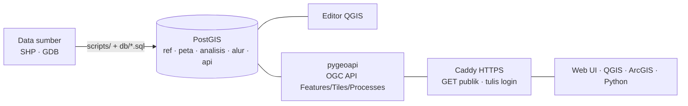

# Pembasahan Gambut 337 KHG — Database Spasial & OGC API

Basis data **PostgreSQL/PostGIS** dan layanan **OGC API** (pygeoapi) untuk aplikasi *Pembasahan Gambut 337 KHG*: perencanaan sekat kanal, pompa, pemantauan hotspot, dan alur review KHG. Bisa diedit dari **QGIS** (koneksi PostGIS langsung) maupun **Web/API**, dengan jejak audit dan versi KHG yang otomatis.

## 🔗 Link
| | |
|---|---|
| **OGC API (demo, publik, baca)** | **https://5-223-68-87.sslip.io** |
| Dokumentasi interaktif (Swagger) | https://5-223-68-87.sslip.io/openapi?f=html |
| Daftar layer | https://5-223-68-87.sslip.io/collections?f=html |
| Koneksi PostgreSQL langsung | Tidak dibuka ke publik. Hanya lewat SSH tunnel dengan kredensial dari pemilik repo (lihat [docs/04](docs/04_PANDUAN_DATABASE.md)) |

> Server demo bersifat **sementara** (Hetzner Singapura, dibuat 30 Sep 2026 untuk demo 1 hari). Setelah dihapus, link di atas tidak aktif lagi. Layanan bisa dibangun ulang dengan [deploy/](deploy/README.md) (±25 menit).
> Username/password untuk operasi tulis dan akses DB **tidak ada di repo ini**; mintalah ke pemilik repo.

## Isi basis data
| Data | Jumlah | Sumber |
|---|---:|---|
| KHG (batas hasil dissolve unit analisis) | 866 (345 target 2026) | BlueBook PEG 2026 |
| Desa (2004 desa target dengan batas) | 5.860 (2.004) | BlueBook PEG 2026 |
| Sekat kanal rencana (kontur × kanal) | 320.167 | Sekat Kanal BRGM PPEG |
| Sekat kanal existing + detail bangunan | 46.204 | Infrastruktur Hidrologis BRGM |
| Kanal (OSM seamless 2025) | 657.621 (±362.500 km) | BlueBook PEG 2026 |
| Hotspot Jan–15 Sep 2026 (MODIS/VIIRS) | 167.718 | FIRMS & SiPongi |
| Areal terbakar 2015–2026 | 584.723 | Burnscar Areas |
| Unit analisis tematik (target + nasional) | 789.336 + 989.398 | BlueBook PEG 2026 |
| Konsesi, ketebalan gambut, kontur, kontur LiDAR 50 cm | 1.070 / 2.938 / 159.043 / 26.968 | BlueBook PEG 2026 |

Total DB ±7 GB. Semua geometri EPSG:4326.

## Dokumentasi
| # | Dokumen | Untuk siapa | Isi |
|---|---|---|---|
| 1 | [Desain Database](docs/01_DESAIN_DATABASE.md) | engineer | Arsitektur, 5 schema, ERD, keputusan desain, trigger & fungsi |
| 1b | [Katalog Tabel](docs/01b_KATALOG_TABEL.md) | engineer/analis | Semua tabel & view: jumlah baris, ukuran, geometri |
| 2 | [Kecocokan UI ↔ Data](docs/02_KECOCOKAN_UI.md) | PM/presenter | 68 elemen UI → tabel/API → status data (ada / sebagian / belum) |
| 3 | [OGC API](docs/03_API_OGC.md) | developer/GIS | Standar, endpoint, 19 koleksi, parameter, contoh CRUD/tiles/processes, klien |
| 4 | [Panduan Database](docs/04_PANDUAN_DATABASE.md) | DBA/analis GIS | Koneksi, role, QGIS, resep SQL, pemeliharaan |
| 5 | [Rencana Deploy & Biaya](docs/05_RENCANA_DEPLOY.md) | pengambil keputusan | Perbandingan Hetzner/Contabo/DO/GCP/Oracle, biaya per hari, rekomendasi |
| 6 | [**Panduan Demo**](docs/06_PANDUAN_DEMO.md) | **presenter** | Alur demo 15 menit, link siap klik, jawaban pertanyaan umum |
| 7 | [Deploy otomatis](deploy/README.md) | DevOps | Hetzner: `provision.sh` + `deploy.sh` |

## Arsitektur singkat


## Menjalankan secara lokal
Prasyarat: Docker, GDAL/OGR (`ogr2ogr`), Python 3 dengan `geopandas` + `pyogrio`, dan `psql`.

1. **Siapkan data sumber** (tidak disertakan di repo; minta ke pemilik data). Letakkan di root repo dengan nama folder persis seperti ini:
   ```
   Sekat Kanal BRGM/                                          (5 shapefile SekatKanal_BRGM_PPEG_*)
   Data Spasial Pemulihan Ekosistem Gambut (April, 2026)/     (Target_BlueBook_Pemulihan_Ekosistem_Gambut_2026.gdb)
   __ Burnscare Areas (2015-2026)/                            (ALL__BA_2015_2026__INDONESIA.shp)
   __ Data Hotspot (Januari-September, 2026)/                 (01..09__Hotspot_*_2026.shp)
   ```
2. **Bangun semuanya** (±10 menit). Perintah ini membuat password acak di `db/.env`, membangun DB, memuat semua data, lalu menyalakan OGC API di http://localhost:8080:
   ```bash
   ./db/setup.sh
   ```
3. **Tulis daftar kredensial lokal** ke `docs/KREDENSIAL.md` (di-gitignore):
   ```bash
   ./db/kredensial.sh
   ```
4. **Uji.** Smoke test CRUD, audit, dan alur versi; semuanya di-ROLLBACK:
   ```bash
   psql -h localhost -p 5433 -U postgres -d gambut -f db/tests.sql
   ```

## Struktur repo
```
api/      pygeoapi-config.yml, gambut_processes.py (OGC Processes), Caddyfile
db/       01..10 *.sql (skema → load → dissolve → role → view API), setup.sh, stage.sh, tests.sql
deploy/   provision.sh (Hetzner), deploy.sh, cloud-init.yml, docker-compose.prod.yml
docs/     01..06 dokumentasi
scripts/  build_gpkg.py (sekat), build_hotspot.py (hotspot)
```

## Catatan & keterbatasan
- **Belum ada datanya** (struktur sudah siap): sungai sumber air, status kanal aktif hasil survei, pompa, logger TMAT, posko, sumur bor, dan kode KHG resmi. Lihat [docs/02](docs/02_KECOCOKAN_UI.md).
- **Hotspot antar-bulan tidak sebanding**: Jan/Apr/Agu/Sep hanya MODIS, sedangkan Feb–Jul juga VIIRS.
- **Rumus skor prioritas & bobot saran lokasi pompa masih sementara** (ditandai `penyederhanaan:` di SQL). Perlu disesuaikan dengan SOP Dit. PPEG.
- **Batasan pygeoapi 0.24**: PUT wajib mengirim `id` + geometri lengkap; PATCH tidak didukung.
- **Kredensial**: file `.env` dan `KREDENSIAL*.md` di-gitignore. Password default `gambut_dev` di `docker-compose.yml` hanya untuk DB lokal; server produksi memakai password acak.
