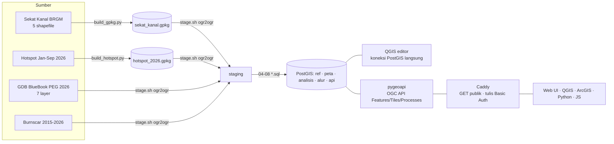
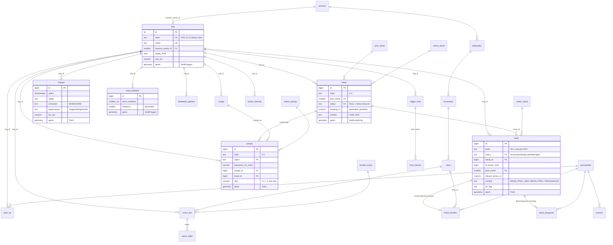
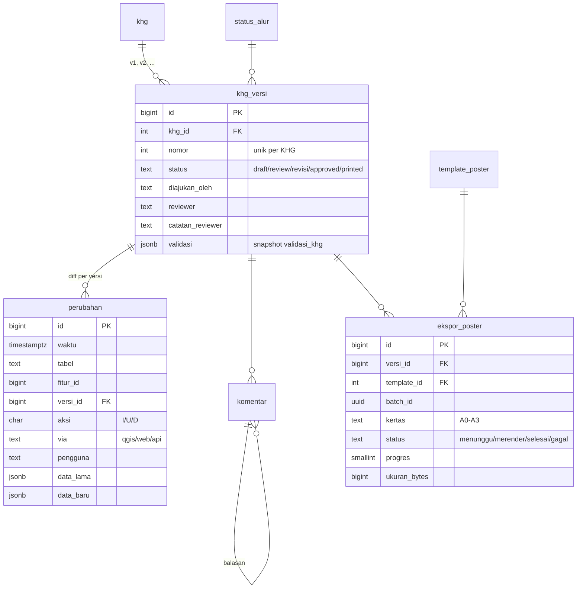
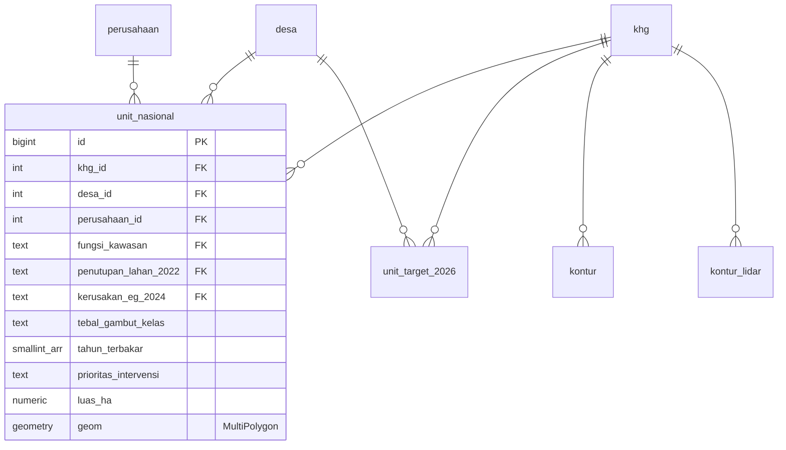

# Desain Database — Pembasahan Gambut 337 KHG

PostgreSQL 17 + PostGIS 3.5. Semua geometri disimpan dalam **EPSG:4326** (lon/lat). Database: `gambut`.

## 1. Arsitektur

## 2. Lima schema
| Schema | Fungsi | Contoh tabel | Siapa yang menulis |
|---|---|---|---|
| `ref` | Referensi: wilayah (kode Kemendagri), KHG, perusahaan, tabel lookup | `provinsi`, `kabupaten`, `kecamatan`, `desa`, `khg`, `perusahaan`, `status_*` | loader / admin |
| `peta` | Layer operasional yang tampil di Workspace Peta; sebagian bisa diedit | `sekat`, `kanal`, `pompa`, `pintu_air`, `hotspot`, `areal_terbakar`, `konsesi`, `ketebalan_gambut`, `sumur_bor` | QGIS, Web, OGC API, loader |
| `analisis` | Layer analisis besar, baca-saja | `unit_nasional` (989 rb), `unit_target_2026` (789 rb), `kontur`, `kontur_lidar` | loader |
| `alur` | Alur kerja & audit: versi KHG, log perubahan, komentar, ekspor poster | `khg_versi`, `perubahan`, `komentar`, `ekspor_poster` | trigger & fungsi |
| `api` | View publik untuk OGC API (nama terbaca, bukan ID asing) + statistik materialized | `khg`, `sekat`, `hotspot`, `khg_statistik` | — (view) |

## 3. ERD
### 3a. Referensi & layer operasional

Semua tabel spasial `peta.*` juga punya kolom meta: `khg_id`, `created_at/by`, `updated_at/by`, `updated_via` (`qgis|web|api|sync|import`), dan `rev` (nomor revisi untuk optimistic lock).

### 3b. Alur kerja & audit

### 3c. Analisis (baca-saja)

`unit_target_2026` memakai struktur yang identik (`CREATE TABLE … (LIKE unit_target_2026 INCLUDING ALL)`).

## 4. Keputusan desain (dan alasannya)
| Keputusan | Alasan |
|---|---|
| **Audit & versi lewat trigger DB** (`a_meta` BEFORE, `b_kode` BEFORE INSERT, `z_audit` AFTER) | Editor QGIS menulis langsung ke PostGIS. Kalau pencatatan dilakukan di aplikasi, edit dari QGIS tidak tercatat. Fungsi trigger bersifat `SECURITY DEFINER`, jadi editor tidak bisa memalsukan log. |
| **Identitas penulis**: `app.pengguna`/`app.via` untuk Web; `session_user` + default role (`ALTER ROLE … SET app.via`) untuk QGIS/API | Satu mekanisme untuk tiga jenis klien tanpa kolom tambahan di tabel data. |
| **Versi terbuka otomatis** (satu draft/review/revisi per KHG; kalau KHG sudah approved lalu diedit, versi n+1 dibuat) | Sesuai UI "v13 → v14" dan tab Riwayat Versi. |
| **Tabel lookup, bukan ENUM** | Langsung bisa dipakai widget *Value Relation* QGIS dan dropdown Web; menambah nilai cukup dengan INSERT. |
| **`sekat` ramping + `sekat_konteks` + `sekat_bangunan` (1:1)** | Layer yang paling sering diedit dan dirender tetap ringan. Konteks overlay (rencana) dan detail bangunan (existing) punya atribut yang sangat berbeda. |
| **Batas KHG, konsesi, dan ketebalan gambut diturunkan dari unit analisis** (`ST_CoverageUnion` dengan fallback `ST_Union`) | Tidak ada layer batas resmi di data sumber; unit analisis nasional membentuk coverage lengkap untuk 866 KHG. |
| **`khg_id` pada layer non-unit diisi secara spasial** (titik wakil ∩ KHG yang dipecah dengan `ST_Subdivide`) | Nama KHG di sumber tidak konsisten. Subdivide mempercepat point-in-polygon ±100×. |
| **Relasi sekat → kanal secara spasial** (toleransi ±2 m untuk rencana, ±30 m untuk existing) | Kolom `Id` di data sekat ternyata ID kontur, bukan ID kanal. |
| **Schema `api` terpisah** (view + materialized `khg_statistik`) | Kontrak publik OGC API stabil walaupun tabel internal berubah. Statistik yang mahal dihitung tidak dijalankan di setiap request. |
| **PK `bigint identity`, satu kolom geometri bertipe tetap, index GIST** | Syarat editing yang mulus di QGIS dan pygeoapi. |

## 5. Trigger & fungsi
| Objek | Jenis | Kegunaan |
|---|---|---|
| `alur.isi_meta()` | BEFORE I/U semua `peta.*` | Mengisi `khg_id` dari geometri, `created_*`/`updated_*`/`updated_via`, dan menaikkan `rev` |
| `alur.isi_kode('P'/'SK'/'K')` | BEFORE INSERT pompa/sekat/kanal | Kode otomatis per KHG |
| `alur.catat_perubahan()` | AFTER I/U/D layer perencanaan | Menulis log ke `alur.perubahan` + versi terbuka. UPDATE tanpa perubahan diabaikan |
| `alur.versi_terbuka(khg)` | fungsi | Mengambil atau membuat versi draft (dengan advisory lock) |
| `alur.validasi_khg(versi, jarak)` | fungsi | 5 aturan "Validasi otomatis" |
| `alur.ajukan_review(versi)` / `alur.putuskan(versi, keputusan, catatan)` | fungsi | Transisi alur kerja |
| `alur.tandai_dicetak()` | trigger `ekspor_poster` | Kalau ekspor selesai: approved → printed |
| `peta.saran_lokasi_pompa(khg, …)` | fungsi | Kandidat lokasi pompa + skor |
| `api.refresh_statistik()` | fungsi | Refresh `api.khg_statistik` |

## 6. Katalog tabel
Lihat [01b_KATALOG_TABEL.md](01b_KATALOG_TABEL.md). File ini dibuat otomatis dari DB dan berisi jumlah baris, ukuran, dan deskripsi setiap tabel.
