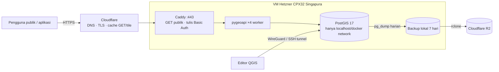

# Rencana Deploy & Estimasi Biaya

## 1. Kebutuhan (dari hasil build lokal)
| Komponen | Angka | Dampak ke server |
|---|---|---|
| Ukuran DB (data + index) | **7,0 GB** hasil build bersih (analisis 4,9 GB, di antaranya kontur WorldDEM 2,3 GB; peta 2,0 GB) | Disk ≥ 80 GB (DB + WAL + 7 dump harian 3,3 GB + OS), 160 GB memberi ruang tumbuh |
| Dump terkompresi (`pg_dump -Fc`) | **3,3 GB** (pembuatan ±5 menit) | Dipakai untuk migrasi dan backup offsite |
| Fitur terbesar | 989 rb + 789 rb poligon, 657 rb garis kanal, 585 rb poligon areal terbakar | RAM ≥ 8 GB; 16 GB lebih lega untuk tile layer besar |
| Hemat disk (opsional) | `ST_Simplify` kontur WorldDEM (toleransi ±1 m) bisa memangkas ±1,5 GB (estimasi, belum diuji) | Opsi 80 GB disk jadi lebih longgar |
| Beban | Beberapa editor QGIS + API publik (baca) | Dominan baca. Tile/respons GET bisa di-cache CDN |
| Layanan | PostgreSQL/PostGIS + pygeoapi + Caddy (3 container) | Satu VM dengan Docker Compose sudah cukup |

## 2. Opsi hosting & biaya per hari
Harga per September 2026, di luar PPN kecuali disebutkan. Biaya per hari = biaya per bulan ÷ 30,4. Kurs **asumsi** €1 ≈ Rp18.500 dan US$1 ≈ Rp16.500; cek kurs aktual sebelum mengajukan anggaran.

| # | Opsi | Spesifikasi | Rincian bulanan | **Per hari** | Latensi ke Indonesia | Catatan |
|---|---|---|---|---|---|---|
| A | **Oracle Cloud Always Free** (Ampere A1) | 2 OCPU / 12 GB* ARM, 200 GB block | €0 | **Rp0** | ±20–40 ms (region Singapura) | *Kuota dipotong dari 4/24 menjadi 2/12 pada 2026. Kapasitas sering habis. Instance idle bisa di-*reclaim*. Tanpa SLA. Image PostGIS resmi tidak ada untuk ARM. Cocok untuk **demo/staging**, bukan produksi |
| B | **Contabo Cloud VPS 6** – Singapura | 6 vCPU / 12 GB / 200 GB SSD | €7,50 (kontrak 24 bln, termasuk PPN) + biaya lokasi Singapura ±€3–10 (**belum terverifikasi**) | **±€0,35–0,58 (Rp6–11 rb)** | ±20–40 ms | Paling murah untuk lokasi dekat Indonesia. Kelemahan: CPU/disk *oversold*, IOPS rendah, support lambat, ada kontrak panjang |
| C | **Hetzner CX43** – Jerman/Finlandia | 8 vCPU / 16 GB / 160 GB NVMe | €15,99 + IPv4 €0,50 + backup 20% €3,20 = €19,69 | **€0,65 (±Rp12 rb)** | ±180–250 ms | Rasio harga–performa terbaik dan andal. Latensi tinggi terasa saat edit QGIS langsung ke PostGIS; API/tile bisa ditutup dengan cache Cloudflare |
| D | **Hetzner CPX32** – Singapura | 4 vCPU / 8 GB / 160 GB NVMe | €26,49 + IPv4 €0,50 + backup 20% €5,30 = €32,29 | **€1,06 (±Rp20 rb)** | ±20–40 ms | Andal, latensi rendah untuk editor QGIS. Kuota traffic Singapura lebih kecil (kelebihan €7,40/TB). RAM 8 GB masih cukup |
| E | DigitalOcean Basic – Singapura | 4 vCPU / 8 GB / 160 GB | $48 + backup 20% $9,60 = $57,60 | $1,89 (±Rp31 rb) | ±20–40 ms | Mudah dipakai, tapi 3× lebih mahal dari D |
| F | DO Managed PostgreSQL 4 GB + Droplet 4 GB (API) | managed, backup otomatis | ±$61 + $24 = ±$85 | ±$2,8 (±Rp46 rb) | ±20–40 ms | Tanpa urus DB sendiri. Cek apakah ekstensi PostGIS versi terbaru tersedia |

| G | **GCP Compute Engine** – Jakarta (asia-southeast2), self-managed seperti D | e2-standard-2: 2 vCPU / 8 GB + 100 GB pd-balanced | $65,78 + disk $13 + IPv4 ±$3,65 + egress internet ±$0,12/GB (100 GB ≈ $12) + snapshot ±$3 ≈ **$97** | **±$3,2 (±Rp53 rb)** | ±5–15 ms (Jakarta) | ±2,6× opsi D, dengan vCPU separuhnya. Komitmen 1 tahun (CUD) memotong komputasi ±37% → ±$73/bln (±Rp40 rb/hari). Satu-satunya opsi di tabel ini yang datanya **di Indonesia** (PP 71/2019) |
| H | **GCP Cloud SQL** (managed) + VM kecil untuk API – Jakarta | Cloud SQL 2 vCPU / 8 GB + 20 GB SSD, e2-small untuk pygeoapi | Cloud SQL ±$120–130 + VM ±$17 + egress | **±$5,5 (±Rp90 rb)** | ±5–15 ms | ±4,5× opsi D. Backup & patch dikelola Google |

Biaya tambahan yang berlaku untuk semua opsi:
- **Cloudflare Free** (DNS, TLS, cache tile & GET, WAF dasar): Rp0.
- **Domain** `.id`/`.com`: ±Rp0,5 rb/hari (±Rp200 rb/tahun).
- **Backup offsite** Cloudflare R2: 10 GB pertama gratis. Dump 3,3 GB × 2 salinan terakhir (6,6 GB) masih masuk kuota gratis.

## 3. Rekomendasi
| Kebutuhan | Pilihan | Per hari |
|---|---|---|
| **Produksi, paling efisien** (andal + dekat Indonesia) | **D. Hetzner CPX32 Singapura** + Cloudflare Free + R2 | **±Rp20 rb/hari (±Rp610 rb/bulan)** |
| Produksi termurah yang masih andal, latensi tinggi bisa diterima (editor kebanyakan memakai OGC API/Web, bukan QGIS langsung) | C. Hetzner CX43 EU + Cloudflare | ±Rp12 rb/hari |
| Anggaran minimum, risiko diterima | B. Contabo Singapura | ±Rp6–11 rb/hari |
| Demo/staging gratis | A. Oracle Always Free | Rp0 |

Alasan memilih D:
- Hetzner stabil dan disk NVMe-nya cepat (penting untuk PostGIS 7 GB yang terus bertambah).
- Singapura membuat edit QGIS langsung ke PostGIS tetap responsif. Setiap simpan fitur butuh puluhan round-trip, jadi 250 ms × puluhan = lambat.
- Harganya ±3× lebih murah dari DigitalOcean.
- Kalau nanti ada kewajiban hosting di Indonesia, arsitektur yang sama bisa dipindahkan apa adanya ke VPS lokal (Biznet Gio/IDCloudHost) atau Pusat Data Nasional. Catatan: PP 71/2019 mewajibkan data sistem elektronik lingkup publik disimpan di Indonesia; ini perlu dikonfirmasi ke pemilik data sebelum go-live.

## 4. Arsitektur produksi


## 5. Langkah deploy
1. **Provision VM.** Pilih Ubuntu 24.04 LTS, lokasi SIN, aktifkan backup Hetzner, dan pasang SSH key. Jangan pakai login password.
2. **Hardening.**
   - `ufw allow 22,80,443/tcp`. Port 5432 **tidak** dibuka ke publik.
   - Aktifkan `unattended-upgrades` dan `fail2ban`.
   - Pasang Docker Engine + compose plugin.
3. **Salin repo** (tanpa folder data sumber) dan buat `db/.env` baru. Semua password **harus berbeda** dari lokal: `openssl rand -base64 24`.
4. **Compose produksi.** Buat `docker-compose.prod.yml` sebagai override:
   - Service `db`: hapus `platform: linux/amd64` (VM sudah x86); `ports: []` supaya tidak diekspos ke host.
   - Set `SITE_ADDRESS=api.<domain>` agar Caddy mengurus sertifikat HTTPS otomatis. Map port `80:80` dan `443:443`.
   - Set `PYGEOAPI_URL=https://api.<domain>`.
   - Pin image pygeoapi ke digest yang sudah diuji (bukan `latest`).
   - Tuning PostgreSQL untuk 8 GB RAM: `shared_buffers=2GB`, `effective_cache_size=6GB`, `work_mem=32MB`, `maintenance_work_mem=512MB`.
5. **Migrasi data.** Jauh lebih cepat daripada build ulang (build ulang ±10 menit di laptop ini, tapi butuh upload data mentah 4,5 GB). Role belum ada di server baru, jadi restore **tanpa owner/privilege**, lalu buat role dan hak akses:
   ```bash
   docker exec gambut_db pg_dump -U postgres -Fc -Z 6 gambut > gambut.dump
   ```
   ```bash
   scp gambut.dump vm:/srv/gambut/
   ```
   ```bash
   docker compose exec -T db pg_restore -U postgres -d gambut --no-owner --no-privileges < gambut.dump
   ```
   ```bash
   docker compose exec -T db psql -U postgres -d gambut -v pw_reader=... -v pw_writer=... -v pw_web=... -v pw_editor=... -f - < 09_roles.sql
   ```
   ```bash
   docker compose exec -T db psql -U postgres -d gambut -f - < 10_api_views.sql
   ```
   *Prosedur ini sudah diuji lokal pada 30 Sep 2026: restore 2 m 48 d, lalu `tests.sql` lolos dan hak akses `ogc_reader`/`ogc_writer` benar.*
6. **DNS Cloudflare.** Buat A record `api` → IP VM (proxied, oranye). Tambahkan cache rule:
   - `/collections/*/tiles/*` di-cache 1 hari.
   - `/collections/*/items*` di-cache 5 menit.
   - Non-GET di-bypass.
7. **Akses editor QGIS.** Pakai WireGuard (disarankan) atau `ssh -L 5433:localhost:5432 vm` per editor. Buat satu role PG per editor (lihat 04_PANDUAN_DATABASE.md §2).
8. **Cron di VM.**
   - 02:00: `pg_dump -Fc` ke `/srv/backup`, simpan 7 hari, lalu `rclone copy` ke R2.
   - 03:00: `SELECT api.refresh_statistik();`
   - Mingguan: `VACUUM ANALYZE`.
9. **Monitoring.** Pakai Uptime Kuma (container kecil) atau healthchecks.io gratis untuk memantau `/` dan `/collections/khg/items?limit=1`. Log Caddy disimpan untuk audit akses.
10. **Uji penerimaan.** Jalankan `db/tests.sql` di server, uji koneksi QGIS lewat OGC API dan PostGIS, uji `curl` tanpa auth untuk POST (harus 401), lalu `docs/03_API_OGC.md` §7.

## 6. Risiko & mitigasi
| Risiko | Mitigasi |
|---|---|
| VM tunggal = *single point of failure* | Backup Hetzner harian + dump offsite R2. Restore ke VM baru ±1 jam (RTO), kehilangan data maksimal 24 jam (RPO). Kalau perlu RPO lebih kecil, tambahkan WAL archiving (pgBackRest ke R2) |
| API publik dibanjiri request tile/items berat | Cache Cloudflare, `max_items: 5000`, `statement_timeout 30s` untuk `ogc_reader`, dan rate-limit Cloudflare (gratis 1 aturan) |
| Password Basic Auth bocor | Ganti `API_ADMIN_PASSWORD` lalu `caddy hash-password`. Semua tulis tercatat di log audit (`via = 'api'`) |
| Kenaikan harga penyedia (Hetzner naik 2026) | Semua komponen berbasis Docker dan portabel; pindah penyedia cukup dengan dump + compose |
| Kepatuhan lokasi data (PP 71/2019) | Konfirmasi dengan pemilik data. Kalau wajib di Indonesia, pakai VPS lokal (arsitektur sama) |

Sumber harga:
- [GCP asia-southeast2 (gcloud-compute.com)](https://gcloud-compute.com/asia-southeast2.html), [Cloud SQL pricing](https://cloud.google.com/sql/pricing)
- [Hetzner — Price Adjustment 15 Juni 2026](https://docs.hetzner.com/general/infrastructure-and-availability/price-adjustment/)
- [costgoat — Hetzner pricing Sep 2026](https://costgoat.com/pricing/hetzner) (IPv4, volume, traffic Singapura)
- [Contabo VPS](https://contabo.com/en/vps/) (biaya lokasi Singapura dari [cybernews](https://cybernews.com/best-web-hosting/contabo-review/pricing/), belum terverifikasi)
- [DigitalOcean pricing 2026 (infratally)](https://infratally.com/articles/digitalocean-droplet-pricing-guide-2026/)
- [Oracle Free Tier 2026 (terminalbytes)](https://terminalbytes.com/oracle-cloud-free-tier-changes-2026/)
